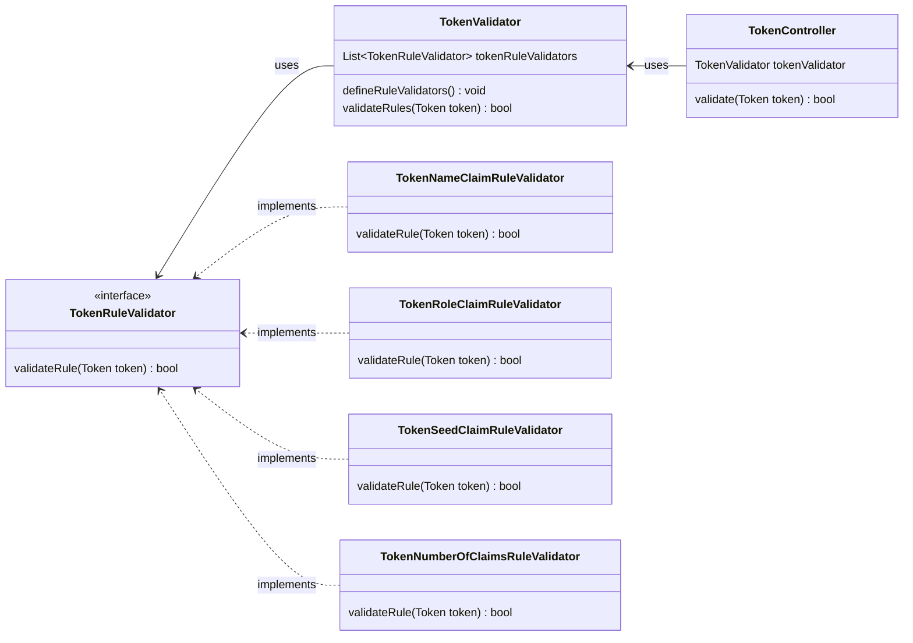

# Documentation

## Class Diagram

Diagram built using mermaid.js. More info on: https://mermaid-js.github.io/mermaid/#/

## References
* Parse JWTs: https://developer.okta.com/blog/2018/10/31/jwts-with-java